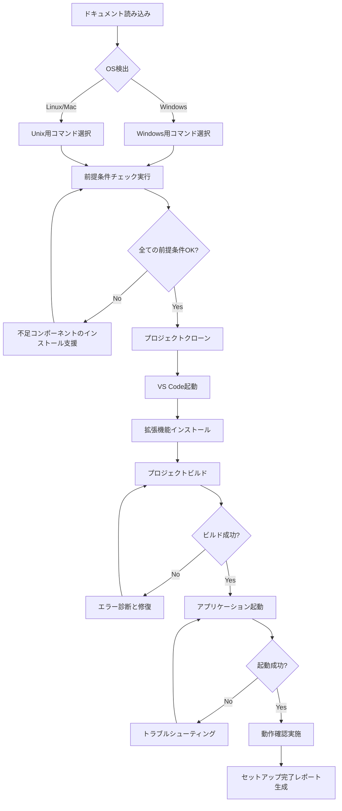

# 🤖 AI向け自動環境構築ガイド

このドキュメントは、AIアシスタントが読み取って自動的に環境構築を実行するための構造化された手順書です。

## 📌 プロジェクト情報

```yaml
project_name: chatapp
repository_url: https://github.com/SuYu0513/newchatapp.git
project_type: Spring Boot Application
language: Java
java_version: "24"
spring_boot_version: "3.5.4"
build_tool: Maven (with wrapper)
database: SQLite
server_port: 9090
```

## 🔍 前提条件チェック

以下のコマンドを順番に実行して、環境の状態を確認してください。

### ステップ1: OSの検出

```bash
# Windows
echo $env:OS

# Linux/Mac
uname -s
```

**期待される結果**: `Windows_NT` (Windows) または `Linux`/`Darwin` (Mac)

### ステップ2: Gitの確認

```bash
git --version
```

**期待される結果**: `git version 2.x.x` 以降

**Gitが見つからない場合の対応**:
- Windows: https://git-scm.com/download/win からインストーラーをダウンロードして実行
- Mac: `brew install git` または Xcode Command Line Toolsをインストール
- Linux: `sudo apt-get install git` または `sudo yum install git`

### ステップ3: Javaの確認

```bash
java -version
```

**期待される結果**: `java version "24"` または `openjdk version "24"`

**Javaが見つからないまたはバージョンが古い場合の対応**:
1. Java 24をダウンロード:
   - Oracle JDK: https://www.oracle.com/java/technologies/downloads/
   - OpenJDK: https://openjdk.org/
   - Amazon Corretto: https://aws.amazon.com/jp/corretto/

2. インストール後、環境変数を設定:
   ```bash
   # Windows (PowerShell - 管理者権限)
   [System.Environment]::SetEnvironmentVariable("JAVA_HOME", "C:\Program Files\Java\jdk-24", "Machine")
   $env:Path += ";$env:JAVA_HOME\bin"
   
   # Linux/Mac (bash/zsh)
   export JAVA_HOME=/path/to/jdk-24
   export PATH=$JAVA_HOME/bin:$PATH
   ```

3. 確認:
   ```bash
   java -version
   javac -version
   ```

### ステップ4: VS Codeの確認

```bash
code --version
```

**期待される結果**: バージョン情報が表示される

**VS Codeが見つからない場合**:
- https://code.visualstudio.com/ からダウンロードしてインストール
- インストール時に「PATHに追加」オプションを選択

## 📥 プロジェクトのセットアップ

### ステップ5: 作業ディレクトリの準備

```bash
# Windows
cd $HOME\Documents
mkdir -p dev\projects
cd dev\projects

# Linux/Mac
cd ~/Documents
mkdir -p dev/projects
cd dev/projects
```

### ステップ6: リポジトリのクローン

```bash
git clone https://github.com/SuYu0513/newchatapp.git
cd newchatapp
```

**検証**:
```bash
# ディレクトリ構造の確認
ls -la
# または (Windows)
dir
```

**期待される結果**: `pom.xml`, `mvnw`, `mvnw.cmd`, `src/` などが存在

### ステップ7: VS Codeでプロジェクトを開く

```bash
code .
```

## 🔧 VS Code拡張機能のインストール

以下のコマンドを**VS Codeのターミナル内**で実行してください（または統合ターミナル内で）。

### ステップ8: 必須拡張機能のインストール

```bash
# Extension Pack for Java
code --install-extension vscjava.vscode-java-pack

# Spring Boot Extension Pack
code --install-extension vmware.vscode-boot-dev-pack

# Thymeleaf
code --install-extension junstyle.vscode-thymeleaf

# REST Client (オプション)
code --install-extension humao.rest-client
```

**検証**:
```bash
code --list-extensions
```

**期待される結果**: インストールした拡張機能のIDが表示される

### ステップ9: Java設定の確認（VS Code内）

VS Codeの `settings.json` を開いて、以下の設定があるか確認:

```json
{
  "java.configuration.runtimes": [
    {
      "name": "JavaSE-24",
      "path": "/path/to/jdk-24",
      "default": true
    }
  ],
  "java.jdt.ls.java.home": "/path/to/jdk-24"
}
```

**自動設定コマンド** (PowerShell - Windows):
```powershell
# JAVA_HOMEが設定されている場合
$javaHome = $env:JAVA_HOME
$settingsPath = "$env:APPDATA\Code\User\settings.json"
# settings.jsonに追記（既存の設定とマージが必要）
```

## 🏗️ プロジェクトのビルド

### ステップ10: 依存関係のダウンロードとビルド

**Windows (PowerShell/CMD)**:
```bash
.\mvnw.cmd clean install -DskipTests
```

**Linux/Mac**:
```bash
chmod +x mvnw
./mvnw clean install -DskipTests
```

**期待される結果**: `BUILD SUCCESS` メッセージが表示される

**エラーが発生した場合**:
1. Javaバージョンを再確認: `java -version`
2. Maven Wrapperが破損している可能性: 
   ```bash
   # mvnwを再ダウンロード
   mvn -N io.takari:maven:wrapper
   ```
3. プロキシ設定が必要な場合: `.m2/settings.xml` を設定

### ステップ11: 初回起動前の確認

```bash
# pom.xmlの確認
cat pom.xml | grep -E "spring-boot|java.version"

# application.propertiesの確認
cat src/main/resources/application.properties | grep -E "server.port|spring.datasource"
```

**期待される結果**:
- Spring Boot: 3.5.4
- Java: 24
- Server Port: 9090
- Database: SQLite

## ▶️ アプリケーションの起動

### ステップ12: 初回起動

**方法A: Maven Wrapper使用**

Windows:
```bash
.\mvnw.cmd spring-boot:run
```

Linux/Mac:
```bash
./mvnw spring-boot:run
```

**方法B: VS Codeタスク使用**

VS Codeで:
1. `Ctrl+Shift+P` (Mac: `Cmd+Shift+P`)
2. "Tasks: Run Task" を選択
3. "Spring Boot Run" を選択

**方法C: VS Code Spring Boot Dashboard**

1. サイドバーで "Spring Boot Dashboard" を開く
2. `chatapp` を右クリック → "Start"

**期待される結果**:
```
Started ChatappApplication in X.XXX seconds
```

### ステップ13: アプリケーションの動作確認

**ブラウザで確認**:
```
http://localhost:9090
```

**cURLで確認**:
```bash
curl -I http://localhost:9090
```

**期待される結果**: HTTP 200 または 302 (リダイレクト)

## 🧪 動作テスト手順

### ステップ14: 基本的な動作確認

1. **ログインページへのアクセス**:
   ```
   http://localhost:9090/login
   ```

2. **ユーザー登録のテスト**:
   ```
   http://localhost:9090/register
   ```

3. **APIエンドポイントの確認** (REST Clientを使用):
   ```http
   ### Health Check
   GET http://localhost:9090/actuator/health
   
   ### Login Endpoint
   POST http://localhost:9090/login
   Content-Type: application/x-www-form-urlencoded
   
   username=testuser&password=testpass
   ```

### ステップ15: ログの確認

```bash
# エラーログの確認
cat logs/error.log

# 最新のログを監視
tail -f logs/error.log

# Windows (PowerShell)
Get-Content logs/error.log -Tail 20 -Wait
```

## 🔄 データベースの初期化

### ステップ16: データベースファイルの確認

```bash
# データベースファイルの存在確認
ls -la chatapp.db

# Windows
dir chatapp.db
```

**データベースをリセットする場合**:
```bash
# アプリケーションを停止
# データベースファイルを削除
rm chatapp.db  # Windows: del chatapp.db

# アプリケーションを再起動（データベースが自動生成される）
```

### ステップ17: 初期データの確認

```bash
# data.sqlの内容確認
cat src/main/resources/data.sql
```

## 🐛 トラブルシューティング自動診断

### 診断スクリプト

**Windows (PowerShell)**:
```powershell
# 環境診断スクリプト
Write-Host "=== 環境診断開始 ===" -ForegroundColor Green

# Java確認
Write-Host "`n[Java]" -ForegroundColor Yellow
java -version 2>&1

# Git確認
Write-Host "`n[Git]" -ForegroundColor Yellow
git --version

# VS Code確認
Write-Host "`n[VS Code]" -ForegroundColor Yellow
code --version

# ポート確認
Write-Host "`n[ポート 9090]" -ForegroundColor Yellow
netstat -ano | Select-String ":9090"

# プロジェクト構造確認
Write-Host "`n[プロジェクトファイル]" -ForegroundColor Yellow
Test-Path pom.xml
Test-Path src/main/java
Test-Path mvnw.cmd

Write-Host "`n=== 診断完了 ===" -ForegroundColor Green
```

**Linux/Mac (bash)**:
```bash
#!/bin/bash
echo "=== 環境診断開始 ==="

# Java確認
echo -e "\n[Java]"
java -version 2>&1

# Git確認
echo -e "\n[Git]"
git --version

# VS Code確認
echo -e "\n[VS Code]"
code --version

# ポート確認
echo -e "\n[ポート 9090]"
lsof -i :9090 || echo "ポート9090は使用されていません"

# プロジェクト構造確認
echo -e "\n[プロジェクトファイル]"
[ -f pom.xml ] && echo "✓ pom.xml" || echo "✗ pom.xml"
[ -d src/main/java ] && echo "✓ src/main/java" || echo "✗ src/main/java"
[ -f mvnw ] && echo "✓ mvnw" || echo "✗ mvnw"

echo -e "\n=== 診断完了 ==="
```

### よくあるエラーと自動修復

**エラー1: `Port 9090 was already in use`**

**診断**:
```bash
# Windows
netstat -ano | findstr :9090

# Linux/Mac
lsof -i :9090
```

**自動修復**:
```bash
# Windows (PowerShell - 管理者権限)
$processId = (Get-NetTCPConnection -LocalPort 9090 -ErrorAction SilentlyContinue).OwningProcess
if ($processId) { Stop-Process -Id $processId -Force }

# Linux/Mac
kill -9 $(lsof -t -i:9090)
```

**エラー2: `Permission denied` (mvnw)**

**自動修復** (Linux/Mac):
```bash
chmod +x mvnw
```

**エラー3: Java バージョン不一致**

**診断と修復**:
```bash
# 現在のJavaバージョン確認
java -version

# JAVA_HOME確認
echo $JAVA_HOME  # Linux/Mac
echo $env:JAVA_HOME  # Windows

# 利用可能なJavaバージョン検索
# Windows
Get-ChildItem "C:\Program Files\Java" | Select-Object Name

# Linux/Mac
/usr/libexec/java_home -V  # Mac
update-alternatives --list java  # Linux
```

## 📊 セットアップ完了チェックリスト

AIは以下のチェックリストを順番に実行し、各項目の結果を報告してください：

- [ ] **環境確認**
  - [ ] OS検出完了
  - [ ] Git バージョン確認完了
  - [ ] Java 24 確認完了
  - [ ] VS Code 確認完了

- [ ] **プロジェクトセットアップ**
  - [ ] リポジトリクローン完了
  - [ ] VS Codeでプロジェクトを開いた
  - [ ] 拡張機能インストール完了
  - [ ] Java設定確認完了

- [ ] **ビルドと起動**
  - [ ] Maven依存関係解決完了
  - [ ] ビルド成功 (BUILD SUCCESS)
  - [ ] アプリケーション起動成功
  - [ ] localhost:9090 にアクセス可能

- [ ] **動作確認**
  - [ ] ログインページ表示確認
  - [ ] データベースファイル生成確認
  - [ ] ログファイル出力確認
  - [ ] エラーなく動作中

## 🎯 AI実行フロー

AIアシスタントがこのドキュメントを読み取った際の推奨実行フローです：



## 📝 AI実行時の注意事項

1. **ユーザー確認が必要な操作**:
   - 外部ソフトウェアのダウンロードとインストール
   - 管理者権限が必要な操作
   - システム環境変数の変更
   - ファイアウォール設定の変更

2. **自動実行可能な操作**:
   - ターミナルコマンドの実行
   - ファイルの読み取りと検証
   - VS Code拡張機能のインストール
   - プロジェクトのビルドと起動

3. **エラーハンドリング**:
   - 各ステップで期待される結果と実際の結果を比較
   - 不一致がある場合は、トラブルシューティングセクションを参照
   - 3回以上失敗した場合は、ユーザーに手動介入を依頼

## 🔐 セキュリティ考慮事項

- データベースファイル (`chatapp.db`) は `.gitignore` に含まれています
- ログファイルには機密情報が含まれる可能性があるため、共有時は注意
- 本番環境へのデプロイ前に `application.properties` のセキュリティ設定を確認

## 📞 サポート情報

- **GitHub Issues**: https://github.com/SuYu0513/newchatapp/issues
- **ドキュメント**: SETUP.md, README.md
- **ログファイル**: `logs/error.log`

---

**このドキュメントは、AIアシスタントによる自動環境構築をサポートするために設計されています。**
**人間のユーザーは、SETUP.mdを参照してください。**
